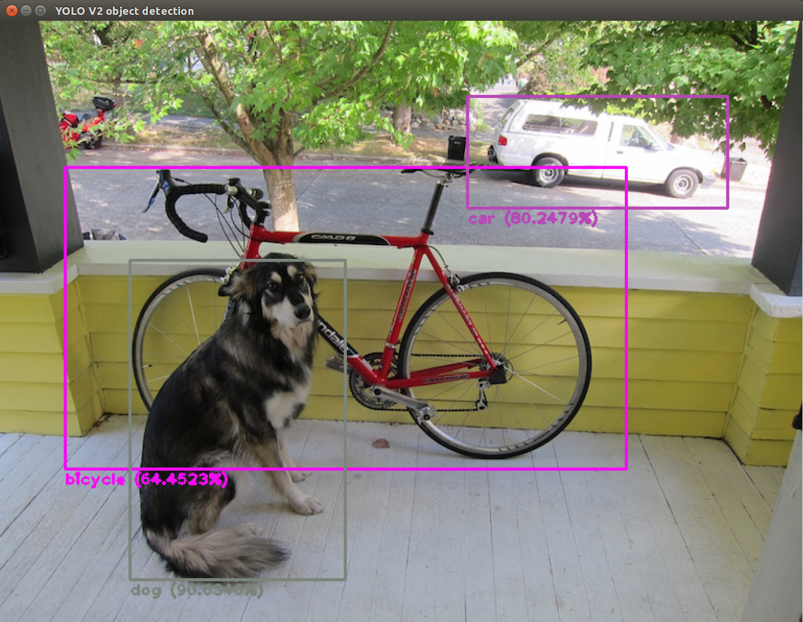
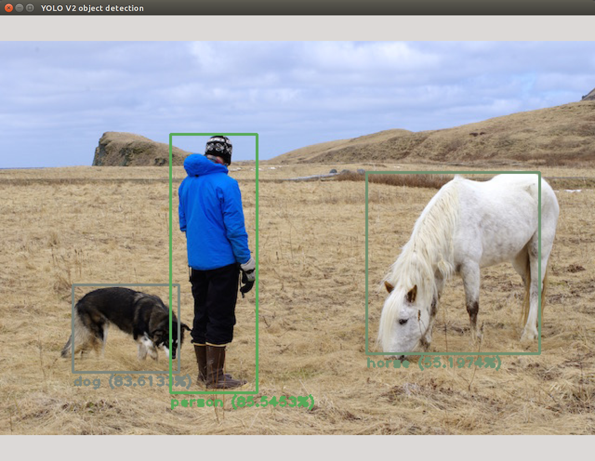

# YOLO ROS: Real-Time Object Detection for ROS

## Overview

This is a ROS package developed for object detection in camera images. You only look once (YOLO) is a state-of-the-art, real-time object detection system. In the following ROS package you are able to use YOLO on GPU and CPU. The pre-trained model of the convolutional neural network is able to detect aeroplane, bicycle, bird, boat, bottle, bus, car, cat, chair, cow, dining table, dog, horse, motorbike, person, potted plant, sheep, sofa, train and tv monitor. For more information about YOLO, Darknet, available training data and training YOLO see the following link: [YOLO: Real-Time Object Detection](http://pjreddie.com/darknet/yolo/).

The YOLO packages have been tested under ROS Kinetic and Ubuntu 16.04. This is research code, expect that it changes often and any fitness for a particular purpose is disclaimed.

**Author: Marko Bjelonic, marko.bjelonic@mavt.ethz.ch**

**Affiliation: Robotic Systems Lab, ETH Zurich**

## Citing

The YOLO methods used in this software are described in the paper: [You Only Look Once: Unified, Real-Time Object Detection](https://arxiv.org/abs/1506.02640).

## Installation

### Dependencies

This software is built on the Robotic Operating System ([ROS]), which needs to be [installed](http://wiki.ros.org) first. Additionally, YOLO for ROS depends on following software:

- [Darknet](https://github.com/pjreddie/darknet) (open source neural network framework written in C and CUDA)
- [OpenCV](http://opencv.org/) (computer vision library),
- [boost](http://www.boost.org/) (c++ library),

### Building

Darknet on the CPU is fast (approximately 1.5 seconds on an Intel Core i7-6700HQ CPU @ 2.60GHz × 8) but it's like 500 times faster on GPU! You'll have to have an Nvidia GPU and you'll have to install CUDA. The CMakeLists.txt file automatically detects if you have CUDA installed or not. CUDA is a parallel computing platform and application programming interface (API) model created by Nvidia. If you do not have CUDA on your System the build process will switch to the CPU version of YOLO. If you are compiling with CUDA, you might receive the following build error:

    nvcc fatal : Unsupported gpu architecture 'compute_61'.

This means that you need to check the compute capability (version) of your GPU. You can find a list of supported GPUs in CUDA here: [CUDA - WIKIPEDIA](https://en.wikipedia.org/wiki/CUDA#Supported_GPUs). Simply find the compute capability of your GPU and replace in darknet_ros/CMakeLists.txt the version number 61 with your version number:

    -O3 -gencode arch=compute_61,code=sm_61

In order to install darknet_ros, clone the latest version from this repository into your catkin workspace and compile the package using ROS.

    cd catkin_workspace/src
    git clone --recursive git@github.com:leggedrobotics/darknet_ros.git
    cd ../
    catkin build darknet_ros

### Download weights

The yolo-voc.weights and tiny-yolo-voc.weights are downloaded automatically in the CMakeLists.txt file. If you need to download them again, go into the weights folder and download the two pre-trained weights

    cd catkin_workspace/src/darknet_ros/darknet_ros/weights/
    wget http://pjreddie.com/media/files/yolo-voc.weights
    wget http://pjreddie.com/media/files/tiny-yolo-voc.weights

### Unit Tests

Run the unit tests with

    catkin build darknet_ros --no-deps --verbose --catkin-make-args run_tests

You will see the following two figures popping up :

